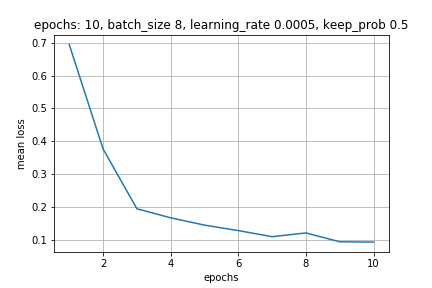
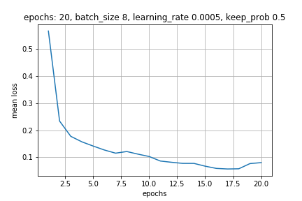
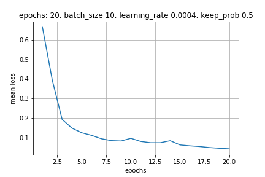
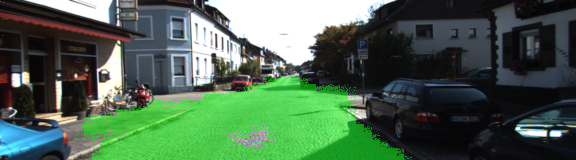
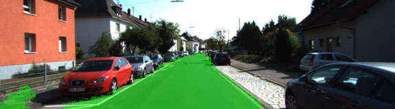
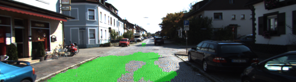
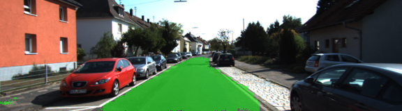
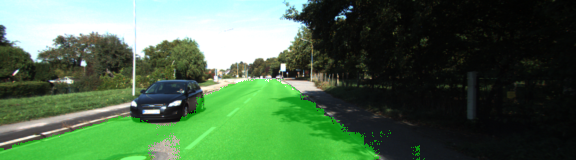
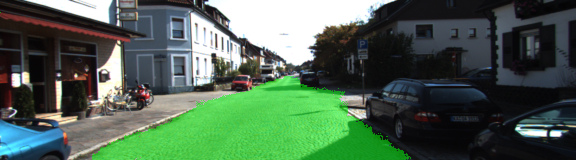
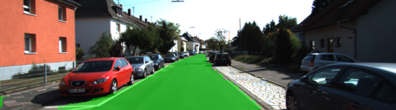

# Semantic Segmentation (Omar Benzakour)

## Goals

The goal of this project is to label the pixels of a road in images using a Fully Convolutional Network (FCN). The VGG and FCN8 papers can be found in the papers folder in the root directory 


## Env set up, dataset and research papers
### Environment (how to run)

The following are required installed:

 - [Python 3](https://www.python.org/)
 - [TensorFlow](https://www.tensorflow.org/)
 - [NumPy](http://www.numpy.org/)
 - [SciPy](https://www.scipy.org/)
 - tqdm (for displaying progress)
 - You may also need [Python Image Library (PIL)](https://pillow.readthedocs.io/) for SciPy's `imresize` function.

I have provided a requirement.yml for conda environments.

**to run the project**:
```
python main.py
```
**Note:** If running this in Jupyter Notebook system messages, such as those regarding test status, may appear in the terminal rather than the notebook.
Here are examples of a sufficient vs. insufficient output from a trained network:

Sufficient Result          |  Insufficient Result
:-------------------------:|:-------------------------:
  |  

### Dataset
Download the [Kitti Road dataset](http://www.cvlibs.net/datasets/kitti/eval_road.php) from [here](http://www.cvlibs.net/download.php?file=data_road.zip).  Extract the dataset in the `data` folder.  This will create the folder `data_road` with all the training a test images.

### Research papers 

The research papers (VGG architecture and FCN) are located in the papers folder. There is some references to these papers in the comments


## architecture

The FCN described in the research paper follows the following architecture:


## Training


We can tune the following hyper parameters to improve our accuracy:

 - learning rate
 - number of epochs
 - batch size
 - the keep probabily
 - regularization coeficients

 
I have started with the following configuration and decided to increase the number of epochs

 - learning rate: 0.0005
 - number of epochs: 10
 - batch size: 8
 - the keep probabily: 0.5
 - regularization coeficients: 1e-3


In order to see the improvements and adjust the parameters, I have written a little script that saves the loss and display it. For the aforementioned parameters we have:



As we can see the mean loss decreases with the number of epoch. Therefore increasing the number of epochs seemed like a good first strategy.



When we see the second graph we see that the mean loss increases which suggests that the we should decrease the learning rate and increase the batch size. Looking at the pictures we can see that there a a way fewer false positives but more false negatives. Let us retrain our network with this configuration


 - learning rate: 0.0004
 - number of epochs: 20
 - batch size: 10
 - the keep probabily: 0.5
 - regularization coeficients: 1e-3


We know have the following mean loss graph:



The mean loss decreases steadily and reaches a new min. Looking at the pictures we can see a great improvement

## Resulting image per configurations

### epochs:10 , batch size 8, learning rate: 0.0005






### epochs:20 , batch size 8, learning rate: 0.0005






### epochs:20 , batch size 10, learning rate: 0.0004






