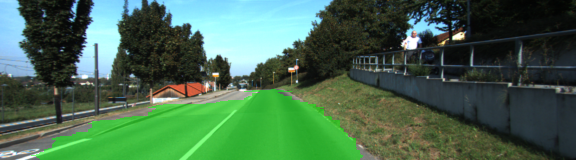

# Semantic Segmentation (Omar Benzakour)

## Goals

The goal of this project is to label the pixels of a road in images using a Fully Convolutional Network (FCN).


## Env set up, dataset and research papers
### Environment (how to run)

The following are required installed:

 - [Python 3](https://www.python.org/)
 - [TensorFlow](https://www.tensorflow.org/)
 - [NumPy](http://www.numpy.org/)
 - [SciPy](https://www.scipy.org/)
 - tqdm (for displaying progress)
 - You may also need [Python Image Library (PIL)](https://pillow.readthedocs.io/) for SciPy's `imresize` function.

I have provided a requirement.yml for conda environments.

**to run the project**:
```
python main.py
```
**Note:** If running this in Jupyter Notebook system messages, such as those regarding test status, may appear in the terminal rather than the notebook.
Here are examples of a sufficient vs. insufficient output from a trained network:

Sufficient Result          |  Insufficient Result
:-------------------------:|:-------------------------:
  |  

### Dataset
Download the [Kitti Road dataset](http://www.cvlibs.net/datasets/kitti/eval_road.php) from [here](http://www.cvlibs.net/download.php?file=data_road.zip).  Extract the dataset in the `data` folder.  This will create the folder `data_road` with all the training a test images.

### Research papers 

The research papers (VGG architecture and FCN) are located in the papers folder. There is some references to these papers in the comments


## architecture

The FCN described in the research paper follows the following architecture:


## Training


We can tune the following hyper parameters to improve our accuracy:

 - learning rate
 - number of epochs
 - batch size
 - the keep probabily
 - regularization coeficients

 
I have started with the following configuration and decided to increase the number of epochs

 - learning rate: 0.0005
 - number of epochs: 10
 - batch size: 8
 - the keep probabily: 0.5
 - regularization coeficients: 1e-3


In order to see the improvements and adjust the parameters, I have written a little script that saves the loss and display it
 

## Example images

##### Implement
Implement the code in the `main.py` module indicated by the "TODO" comments.
The comments indicated with "OPTIONAL" tag are not required to complete.
